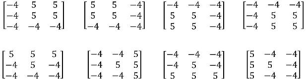
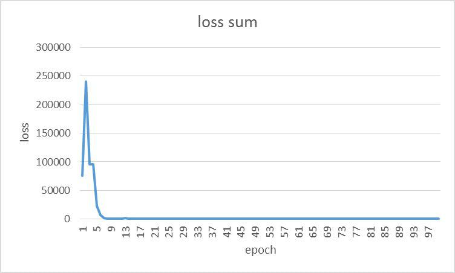
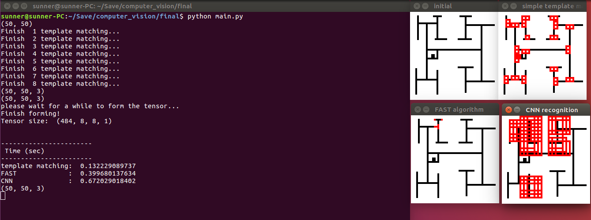
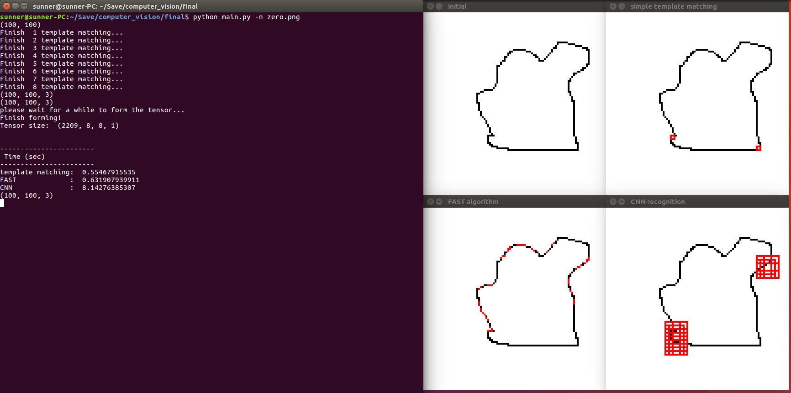
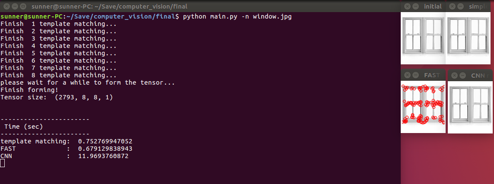

# Computer Vision Mid-term Project

Abstract
---
My project title is "template matching corner detection". In this project, I implement and compare the three related methods of corner detection:
1. template matching
2. FAST algorithm (machine learning based)
3. CNN based architecture

Detail
---
In the template matching method, I use 8 mask to judge the corner. The contain of the masks are shown below:



The second method is the FAST algorithm. The rough idea about the algorithm is that it would exam if there are more than `3/4` neighbor are different around the key point. Moreover, it can be accelerated if it drops the point by four 90 degree neighbors. The following graph illustrates the meaning of the process. 


The last method is deep learning structure. The following quote demonstrates the architecture of my thinking. The kernel would do the slide-window shiftting on the image. To simulate this process, I split the ROI and form as a tensor. Next, I send into the CNN and judge if it's the corner. 

> conv -> relu -> pool -> drop -> conv -> relu -> fc

The objective function of this network is just the simple cross entropy function, and It really reaches my expectation. The image shows the convergence process below. 


Result
---
This part shows the result about the performance and the time comsumption. In each image, there're four part of result I would show. 

* The left-upper image is the origin
* The right-upper image is the result after performing template matching
* The left-bottom image is the result of FAST algorithm
* The right-bottom image is the result after CNN conducts


First, I show the performance toward the simple.png. In this picture, the image is composed by the single-pixel line. For this situation, the performance of the template matching is more powerful. On the other hand, the performance of FAST algorithm is not well as the expection. The reason might be that the composing of the image is too arbitrary. It's means the distribution of the intensity is too distributed. 


The second one is the result of zero.png. The most difference between the simple.png and this one is that it's not composed by the 90-degree components. As the result, the template matching cannot conquer this task perfectly. On the other hand, the CNN based method also shows the ability to recognize the corner in some way. 


The final result is the window image. This image is a more natural photo, and it also follow the distribution of the normal intensity phenomenon. As the result, the FAST algorithm can reach the highest performance.


In the last part, I want to mention the performance and limitation of the CNN based method. Since the training data is almost composed by the single-pixel components, So it might get the worse performance while it confronts the natural image. Second, the sliding window is the bottleneck of the time limitation. The more bigger the image it is, the more time it should spend. 

<br/>

Usage
---
**NO GUI！** But I just provide the cmd usage. 

Train the new model:
```
python train.py
```

Test the result:
```
python main.py -h
```
The upper command can check the usage of the argument.

<br/>

Software Requirement
---
1. python 2.7
2. opencv (including FAST feature descriptor component)
3. tensorflow

* You might need to install anaconda by yourself if you run on the windows. 
* I don't garentee if the code can run completely since there some path operation, and I follow the unix format rather than the windows. ex. `img/1.png` is valid in unix, but `img\1.png` is valid in window.